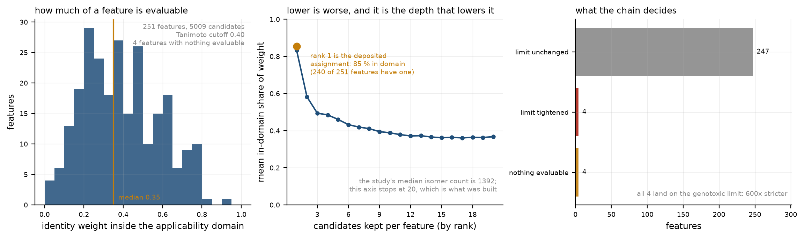

# genotox-food-migrants

Genotoxicity predictor for food-packaging migrants, trained on EFSA conclusions
and connected to the per-feature candidates of a GC-MS candidate export.




## Setup

RDKit and LightGBM are not trivial to install on arm64, so the versions below are
pinned to the ones this notebook was developed and validated against.

```bash
cd ~/Desktop/genotox-food-migrants
python3.12 -m venv .venv
.venv/bin/pip install -r requirements.txt
```

## How to open it

```bash
.venv/bin/marimo edit notebooks/genotox_marimo.py   # interactive, opens a browser tab
.venv/bin/python notebooks/genotox_marimo.py        # runs everything, no browser
```

The second command is also the regression test: exit code 0 means the whole notebook
runs **with the default control values**. It does not explore the parameter space --
running the file as a script uses the defaults of every `mo.ui` element.

`.venv/bin/marimo export script notebooks/genotox_marimo.py` additionally validates the
reactive graph (duplicate definitions, cycles).

## Layout

The notebook has 19 numbered sections spread over 68 `@app.cell` blocks. It only imports and orchestrates; the logic lives in `src/`.

| Path | Contents |
|---|---|
| `notebooks/genotox_marimo.py` | The notebook. No logic inside. |
| `src/paths.py` | Every path, relative to the repository root. |
| `src/environment.py` | Fixed seeds and the version table. |
| `src/data.py` | EFSA loading; distinguishes rows from substances. |
| `src/labels.py` | Audit of the seven label values and aggregation per substance. |
| `src/chemistry.py` | RDKit standardization (cached), ECFP4, scaffolds, Tanimoto, and the partial DNA-reactive alert list of section 17. |
| `src/splitting.py` | Bemis-Murcko scaffold split, multi-seed. |
| `src/models.py` | Baselines, imbalance metrics, calibration, domain curve. |
| `src/figures.py` | The ten figures. None of them writes to disk. |
| `src/ambiguity.py` | The declared-ambiguity bench: candidate sets, weighting schemes, quality and size sweeps, permutation test. |
| `src/ttc.py` | TTC limits, the genotoxic branch and the crossing summary. |
| `src/fixture.py` | The synthetic feature table the GC-MS sections fall back to. |
| `src/provenance.py` | Where each number on screen came from. |
| `src/resolver.py` | Name and identifier resolution to structures. |
| `src/public_features.py` | The public MetaboLights path: assignment files, candidate sets per formula, the shipped bundle and the per-study identity-evidence audit. |
| `src/candidates.py` | Isomer enumeration by formula against PubChem, with a disk cache. |
| `src/retention.py` | The retention-index branch: calibration, out-of-fold prediction and the within-formula ordering it supports. |
| `src/gcms.py` | **Read-only** access to the candidate database and parquet export. |
| `src/integration.py` | From per-feature candidates to an identity-weighted genotoxicity score, and the per-feature handover table. |
| `src/external.py` | Optional merge with external mutagenicity sources. |
| `src/legacy/` | Exploratory scripts from before this notebook existed. Nothing here is imported by the notebook or by `src/`; they are kept for provenance. The ones that read a ChromaDB collection take its location from `CAS_CHROMA_PATH`. |
| `cache/` | Generated on first run. Holds the RDKit standardization cache so the second run takes seconds instead of a minute. Safe to delete. |

## Decisions worth not losing

- **An EFSA row is not a substance.** It is one conclusion from one output. Some
  substances have several rows and a few contradict each other across outputs.
- **The aggregation key is the raw InChIKey, not the standardized one.** The real
  order is: aggregate by `inchikey` (section 4) -> standardize (section 6) ->
  `drop_duplicates(subset="inchikey_std")`. Consequence: if two raw InChIKeys
  collapse onto the same standardized key (a salt and its free acid, two
  tautomers), each is aggregated separately and the deduplication keeps the first
  by table order, so the aggregation rule never arbitrates between them. Measured
  on the current data: 57 standardized keys receive more than one aggregated row,
  and 6 of those carry conflicting labels. Small, but it is table order deciding,
  not the rule.
- **Only two of the seven label values are informative.** `Positive` (165 rows with
  structure) and `Negative` (3400). Four mean absence of data and are dropped
  together: `Not determined` (2438), `No data` (1086), `Other` (29),
  `Not applicable` (3). `Ambiguous` (515) is genuinely ambiguous and its handling
  is a notebook control, not a hidden constant.
- **The ~7 % prevalence holds for the default settings.** With
  `ambiguous = "exclude"` the modelable set is 1975 substances, 138 of them
  positive. There are 515 `Ambiguous` rows against 165 `Positive`, so switching the
  control to `positive` changes the prevalence drastically -- and with it every
  statement below about the imbalance.
- **The split is by scaffold, never random.** A random split on this dataset
  inflates the metrics: homologous series would fall on both sides.
- **Accuracy is not reported.** At ~7 % positives, always predicting negative scores
  93 % and carries no information. Reported instead: PR-AUC (with prevalence as the
  baseline), ROC-AUC, MCC and positive recall.
- **Every number in the notebook comes from public data by default.** EFSA for
  the labels, MetaboLights for the feature tables and their assigned
  identities, PubChem for the isomers of each formula. A local candidate
  export is an optional override, and when it is absent nothing in the
  notebook is simulated: the identity sections run on a deposited study and
  say which one on screen.
- **A public deposit publishes no score per candidate.** There is one assigned
  identity per feature and nothing to rank its alternatives by, so `uniform`
  is the only weighting the public path can support -- not a fallback chosen
  here, and section 13 shows the audit behind the claim. The three weighting
  methods and the `evidence` column they need apply to a local export only,
  where turning that column into weights remains an explicit assumption.
- **The structural alerts are computed here, not published.** No deposit
  carries a genotoxicity alert, so section 17 matches a short and deliberately
  partial list of DNA-reactive classes (`chemistry.DNA_REACTIVE_ALERTS`). It
  is not the Benigni-Bossa rulebase and agreement figures against it are not
  comparable to one.
- **The notebook never reruns any identification.** The public path reads the
  depositors' assignments as published; a local export is opened as
  `file:...?mode=ro` and written to parquet.

## Optional inputs

**GC-MS candidate export.** The identity-uncertainty section runs on a public
MetaboLights study by default, so nothing is required here. A local export
takes precedence over the public study when *either* condition holds:

```bash
export GCMS_DB=/path/to/your_export.sqlite   # or
# data/gcms_candidates.parquet already exists from a previous export
```

The public path needs no credentials. Its candidate sets ship precomputed in
`data/public_candidates.parquet`; delete that file and the same code rebuilds
them from MetaboLights and PubChem, which takes about half an hour per study
on a cold cache. `src/public_features.py:bundle()` is what regenerates it.

**External mutagenicity sources.** Drop any number of CSV files into
`data/external/`, each with the columns `smiles,y,source` where `y` is 0 or 1.
The merge reports conflicts against EFSA separately rather than silently
resolving them.

## License and data attribution

The code in this repository is released under the MIT License (see `LICENSE`).
The data files shipped in `data/` are **derived works** from three public
sources, each under its own terms, and nothing here relicenses them.

| File | Derived from | Terms |
|---|---|---|
| `data/genotoxicity_cas_cid.xlsx` | EFSA OpenFoodTox, genotoxicity conclusions per substance and output | CC BY 4.0. Cite EFSA as the source. |
| `data/efsa_estructuras.csv` | The above, joined to structures resolved through the PubChem PUG REST API | CC BY 4.0 for the EFSA columns; PubChem identifiers and structures are US NLM/NCBI public data. |
| `data/public_candidates.parquet`, `data/public_features.parquet` | Metabolite assignment files from seven MetaboLights studies, with candidate isomer sets enumerated from PubChem | EMBL-EBI terms of use; individual studies carry their own data-license field. Cite each accession. |
| `data/alert_agreement.csv`, `data/identity_evidence_by_study.csv` | Computed by this notebook from the files above | MIT, same as the code. |

### Sources

**EFSA OpenFoodTox.** European Food Safety Authority, *OpenFoodTox: the EFSA
Chemical Hazards Database*. Genotoxicity conclusions extracted per substance
and per scientific output. <!-- Fill in the release you downloaded and its
Zenodo DOI; OpenFoodTox is versioned and the row counts in section 1 belong to
one specific release. -->

**MetaboLights** (EMBL-EBI). Metabolite assignment files from studies
MTBLS1866, MTBLS627, MTBLS522, MTBLS8966, MTBLS519, MTBLS4497 and MTBLS892.
Only the
assignment tables are read; no raw spectra are redistributed here. Each study
has its own depositors and its own publication. All six carry the same
dataset-license field, the EMBL-EBI Terms of Use
(<https://www.ebi.ac.uk/about/terms-of-use/>), verified per accession through
the MetaboLights API; none is more restrictive than the rest, so all six stay
in the bundle with per-accession citation.

**PubChem** (NLM/NCBI). Structures, InChIKeys, formulae and the isomer sets
enumerated per molecular formula, retrieved through the PUG REST API.

### How to cite this work

<!-- A CITATION.cff file makes GitHub render a "Cite this repository" button.
Add one once the repository has a permanent home. -->

### Scope statement

The notebook produces a hazard prioritisation, not a risk assessment, and the
EFSA conclusions it learns from are regulatory conclusions aggregating several
assays rather than the outcome of any single test. Neither the model nor the
tables in `data/` should be quoted as an EFSA position. For regulatory use,
consult the original EFSA scientific outputs.

## Phases

The numbering comes from the original plan, and the phases were not done in order.
What exists here is phase 1 (the EFSA model) and phase 4 (the GC-MS integration);
the integration was built before the phase 2 and 3 models and does not depend on
them. Section 12 of the notebook documents both as not implemented:

- **Phase 2. Chemprop ensemble + conformal prediction.** Chemprop is not in the
  environment and adding it pulls in torch.
- **Phase 3. MEGAN.**
