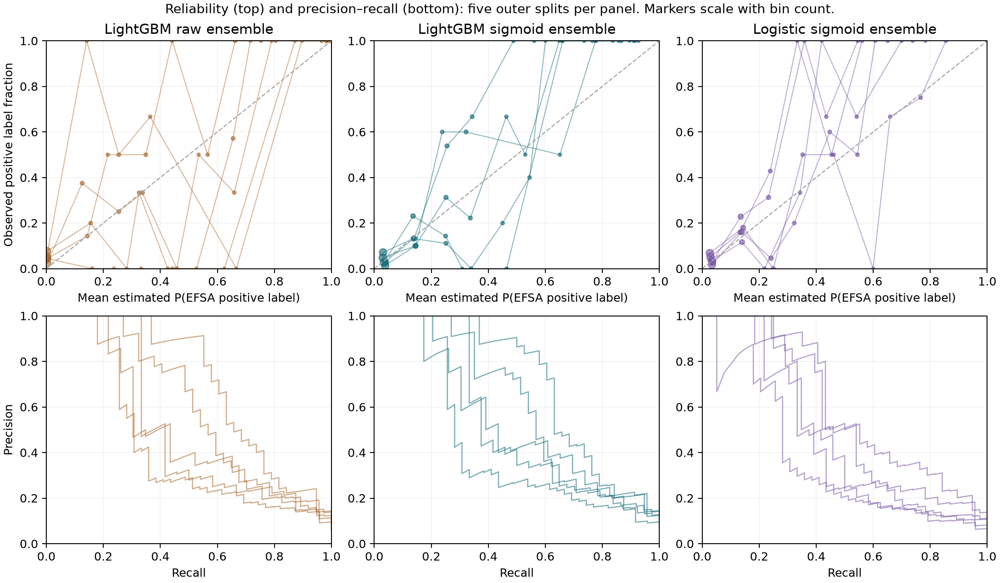
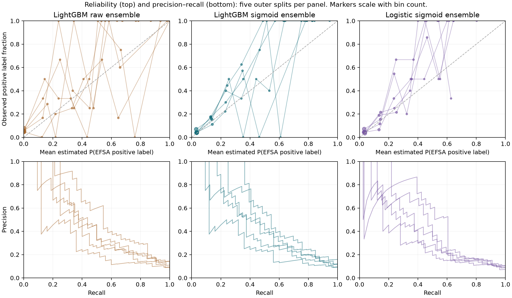
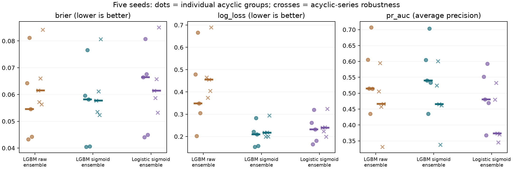
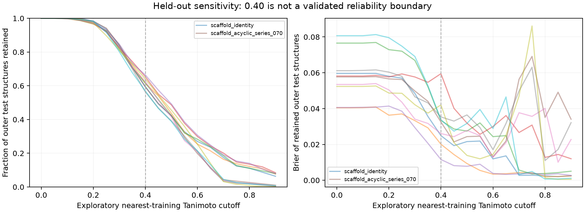

# Generated internal validation

Reproduce: pinned requirements + `python scripts/validate_calibration.py`.

Endpoint: aggregated positive EFSA label conditional on a supported standardized structure.
Independent compatible endpoint validation has not been performed. Label content matches the verified [2023 OpenFoodTox export](https://doi.org/10.5281/zenodo.8120114); historical download date and enrichment logs were not recorded.

Raw/sigmoid ensembles use the same fitted classifiers. Values: median [Q1–Q3] across five outer seeds.

## scaffold_identity

| Model | AP (PR area) | Brier | Log loss | ECE |
|---|---:|---:|---:|---:|
| prior | 0.0979 [0.0635–0.1005] | 0.0896 [0.0595–0.0920] | 0.3303 [0.2368–0.3379] | 0.0365 [0.0098–0.0398] |
| lgbm_raw_single | 0.5807 [0.4862–0.5907] | 0.0536 [0.0535–0.0646] | 0.3329 [0.2807–0.5082] | 0.0522 [0.0517–0.0645] |
| lgbm_raw_ensemble | 0.5145 [0.5140–0.6053] | 0.0545 [0.0442–0.0643] | 0.3484 [0.3054–0.4786] | 0.0537 [0.0479–0.0640] |
| lgbm_sigmoid_ensemble | 0.5397 [0.5331–0.6048] | 0.0582 [0.0406–0.0596] | 0.2094 [0.1581–0.2217] | 0.0345 [0.0336–0.0346] |
| logistic_raw_ensemble | 0.5008 [0.4768–0.5595] | 0.0616 [0.0587–0.0633] | 0.2178 [0.1958–0.2642] | 0.0522 [0.0428–0.0702] |
| logistic_sigmoid_ensemble | 0.4808 [0.4696–0.5516] | 0.0665 [0.0450–0.0676] | 0.2314 [0.1811–0.2621] | 0.0351 [0.0339–0.0395] |

## scaffold_acyclic_series_070

| Model | AP (PR area) | Brier | Log loss | ECE |
|---|---:|---:|---:|---:|
| prior | 0.0847 [0.0847–0.0873] | 0.0779 [0.0779–0.0802] | 0.2930 [0.2930–0.3003] | 0.0199 [0.0199–0.0232] |
| lgbm_raw_single | 0.4724 [0.4335–0.5266] | 0.0601 [0.0601–0.0628] | 0.4634 [0.4164–0.4643] | 0.0626 [0.0612–0.0656] |
| lgbm_raw_ensemble | 0.4661 [0.4574–0.5055] | 0.0616 [0.0572–0.0660] | 0.4558 [0.4046–0.4646] | 0.0617 [0.0533–0.0625] |
| lgbm_sigmoid_ensemble | 0.4655 [0.4622–0.5242] | 0.0577 [0.0535–0.0612] | 0.2173 [0.1999–0.2181] | 0.0199 [0.0198–0.0199] |
| logistic_raw_ensemble | 0.3607 [0.3574–0.4822] | 0.0638 [0.0635–0.0700] | 0.2534 [0.2450–0.2623] | 0.0557 [0.0483–0.0647] |
| logistic_sigmoid_ensemble | 0.3734 [0.3704–0.4800] | 0.0615 [0.0587–0.0658] | 0.2394 [0.2230–0.2410] | 0.0316 [0.0221–0.0333] |

Saved: held-out predictions, train/test and inner fold identity lists, overlap audits, training-only cutoff OOF scores, and chosen-cutoff held-out metrics.
